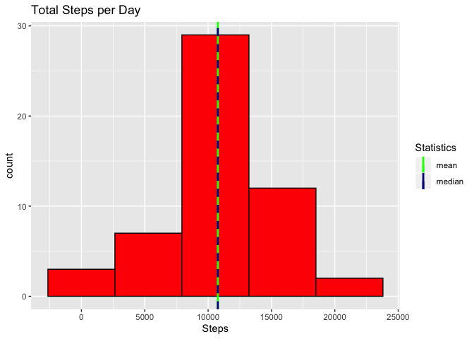
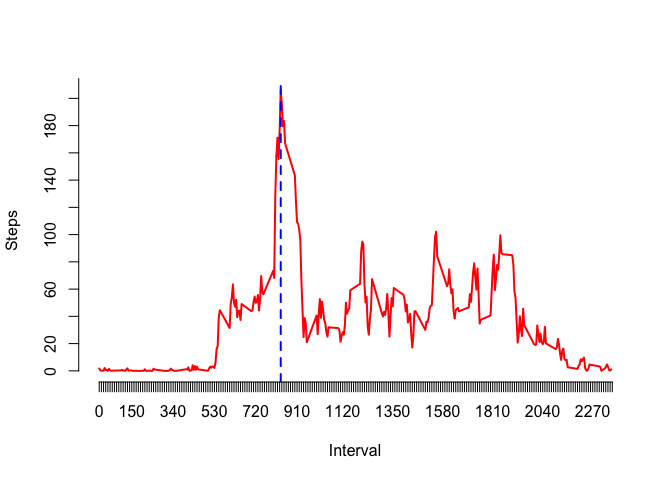
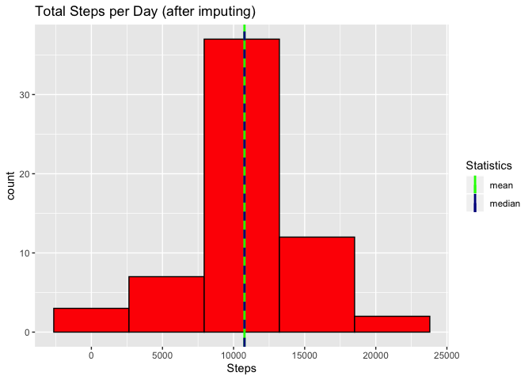
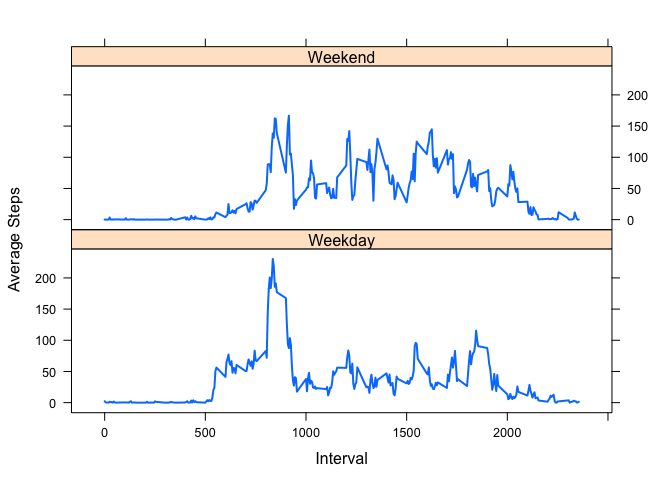

```r
# Make sure we use the correct figure folder
knitr::opts_chunk$set(fig.path="figure/")
```


## Loading and preprocessing the data
We can directly load the data from the zipped file. 
The file contains 3 columns: The steps, the day (as a date), and the interval of the day. 
We save the data in the data frame "activity" and use "str" to show a brief summary. 


```r
activity = read.csv(unz("activity.zip","activity.csv"))
str(activity)
```

```
## 'data.frame':	17568 obs. of  3 variables:
##  $ steps   : int  NA NA NA NA NA NA NA NA NA NA ...
##  $ date    : Factor w/ 61 levels "2012-10-01","2012-10-02",..: 1 1 1 1 1 1 1 1 1 1 ...
##  $ interval: int  0 5 10 15 20 25 30 35 40 45 ...
```


## What is mean total number of steps taken per day?
We use the R function "aggregate" to compute the total number of steps taken per day.
(Missing data is simply ignored for now.) 

```r
perDay <- aggregate(steps ~ date , activity, FUN=sum,na.rm=TRUE)
```

To get an overview of the data, we first plot a histogram of the total steps taken per day. We also add a solid green vertical line at the position of the mean (10766.19 steps) and a blue dashed line at the position of the median (10765 steps). 

```r
library(ggplot2)
myplot <- ggplot(data=perDay,aes(perDay$steps)) + 
          geom_histogram(bins=5,col="black",fill="red") +
          geom_vline(aes(xintercept=mean(perDay$steps),colour="mean"),size=1) + 
          geom_vline(aes(xintercept=median(perDay$steps),colour="median"),size=1,linetype="dashed") +
          labs(title="Total Steps per Day", x="Steps") + 
          scale_color_manual(name = "Statistics", values = c(median = "darkblue", mean = "green"))
          
myplot
```

<!-- -->

## What is the average daily activity pattern?
It is straightforward to aggregate the average steps per interval.

```r
perInt <- aggregate(steps ~ interval, activity,FUN=mean)
perInt$interval <- as.numeric(as.character(perInt$interval))
plot(perInt,type="l",col="red",xlab="Interval",ylab="Steps",lty=1,lwd=2,axes=FALSE)
axis(side = 1, at = seq(0,2360,10))
axis(side = 2, at = seq(0,260,20))

idx <- which(perInt$steps==max(perInt$steps))
abline(v=perInt$interval[idx],lty=2,lwd=2,col="blue")
```

<!-- -->


The maximal number of steps is 206.1698113 and occurs in interval 835. 


## Imputing missing values
Let us now take care of the missing values. First we calculate the number of missing entries. 

```r
numNA <- sum(is.na(activity$steps))
```
We find that 2304 entries are missing. Next we get the index of the missing values. One way to fix this is to simply insert the mean over the 5-minute intervals when data for an interval is missing. 

```r
# There are 61 days of data 
ins <- rep(perInt$steps,61) 
miss <- which(is.na(activity$steps))
new_activity <- activity
new_activity$steps[miss] <- ins[miss]
```
Now we repeat our calculation of the average steps per day for the new data. 


```r
new_perDay <- aggregate(steps ~ date , new_activity, FUN=sum,na.rm=TRUE)

new_myplot <- ggplot(data=new_perDay,aes(new_perDay$steps)) + 
            geom_histogram(bins=5,col="black",fill="red") +
            geom_vline(aes(xintercept=mean(new_perDay$steps),colour="mean"),size=1) + 
            geom_vline(aes(xintercept=median(new_perDay$steps),colour="median"),size=1,linetype="dashed") +
            labs(title="Total Steps per Day (after imputing)", x="Steps") + 
            scale_color_manual(name = "Statistics", values = c(median = "darkblue", mean = "green"))

new_myplot
```

<!-- -->

Comparing the result with the previous histogram, we find that the general distribution of the data is the same after imputing missing data.  

## Are there differences in activity patterns between weekdays and weekends?
Finally, we want to check if there are differences between weekdays and weekends. To answer this question we first introduce an new column in our activity data set. (We will use the new data set, where the missing values have been imputed.) 


```r
dates <- as.Date(new_activity$date)
tst <- (weekdays(dates,abbreviate = TRUE) %in% c("Sat","Sun"))
wd <- rep("Weekday",length(dates))
wd[tst] <- "Weekend"

new_activity$wd <- as.factor(wd)

pltData <- aggregate(new_activity$steps,by=c(list(Day=new_activity$wd),list(Interval = new_activity$interval)),FUN=mean)

library(lattice)
xyplot(x~as.numeric(Interval) | Day, 
       data=pltData,
       type="l",
       lwd=2,
       layout=c(1,2),
       xlab="Interval",
       ylab="Average Steps")
```

<!-- -->


